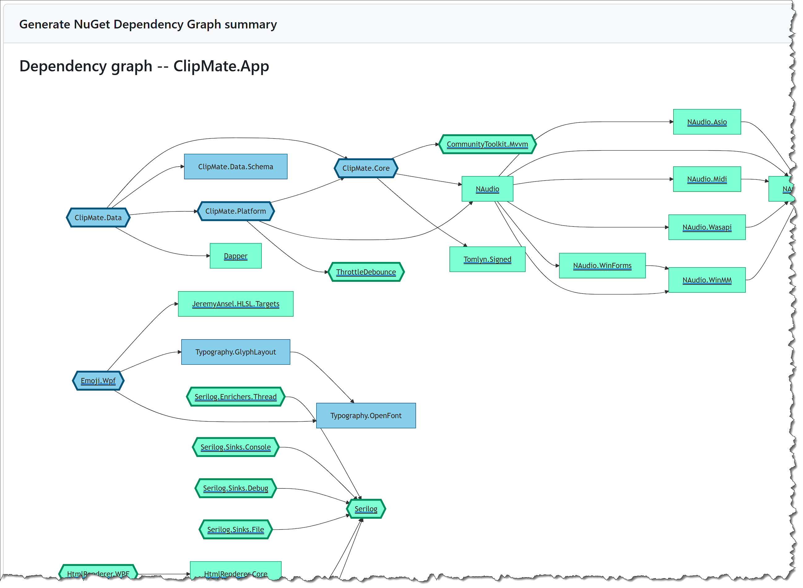

# nugraph-action

[](https://github.com/Tsabo/nugraph-action/actions/workflows/test.yml)
[](https://github.com/Tsabo/nugraph-action/releases)
[](https://github.com/marketplace/actions/nuget-dependency-graph)
[](LICENSE)

This repository provides a reusable GitHub Action and workflow example for generating a NuGet dependency graph from a .NET solution or project by using [0xced/nugraph](https://github.com/0xced/nugraph).

For local/command-line usage, install and run nugraph directly per its own docs — see [0xced/nugraph](https://github.com/0xced/nugraph).

## What is included

- A composite GitHub Action in [action.yml](action.yml)
- A manual workflow example in [examples/basic.yml](examples/basic.yml)
- A private-feed variant in [examples/private-feed.yml](examples/private-feed.yml)
- A pull request job-summary variant in [examples/job-summary.yml](examples/job-summary.yml)
- A custom graph-styling variant in [examples/custom-graph.yml](examples/custom-graph.yml)

## Usage as a GitHub Action

```yaml
jobs:
  graph:
    runs-on: ubuntu-latest
    steps:
      - uses: actions/checkout@v7

      - uses: Tsabo/nugraph-action@master
        with:
          project-path: ./src/MyApp.sln
          output-path: artifacts/nugraph/graph.svg
```

See [examples/basic.yml](examples/basic.yml) for a full manual (`workflow_dispatch`) workflow you can copy into a consuming repo's `.github/workflows/` directory.

## Solution files

[nugraph](https://github.com/0xced/nugraph) itself has no concept of `.sln` files -- it only understands a single project (or a directory containing exactly one) and errors out ("Solution files are not supported") if you point it at a solution directly. This action works around that: when `project-path` ends in `.sln`, it parses the solution, finds every `.csproj`/`.fsproj`/`.vbproj` it references, and runs nugraph once per project.

This changes two things for solution input specifically (a plain project path is unaffected and behaves exactly as before):

- **Job summary**: each project gets its own `### <job-summary-title> -- <ProjectName>` heading and Mermaid block, all appended to the same job summary.
- **`output-path`**: each project's graph is written next to the configured path with the project name inserted before the extension, e.g. `artifacts/nugraph/graph.svg` becomes `artifacts/nugraph/graph.MyApp.svg`, `artifacts/nugraph/graph.MyApp.Tests.svg`, etc. Use a glob (e.g. `artifacts/nugraph/*.svg`) when uploading these as a workflow artifact, since the exact filenames depend on the projects in the solution.

## Output formats

nugraph's `--output` option always writes raw graph source text — a Mermaid diagram if `output-path` ends in `.mmd`/`.mermaid`, otherwise Graphviz DOT text — it never renders an image itself. For image extensions (`.svg`, `.png`, `.pdf`, `.jpg`/`.jpeg`), this action renders the Graphviz DOT source into that image locally using Graphviz's `dot` (installed via `apt-get` on the runner if not already present, no external service involved). Mermaid output (`.mmd`/`.mermaid`) is left as raw source text, viewable at [mermaid.live](https://mermaid.live) — this action doesn't render Mermaid diagrams to images. See [0xced/nugraph](https://github.com/0xced/nugraph) for everything nugraph itself supports.

## Job summaries

`job-summary` appends the graph as a native Mermaid diagram to the workflow's job summary — no separate step or artifact needed. It defaults to `'true'` when `output-path` is unset and `'false'` when `output-path` is set, so the minimal setup already gives you a summary:

```yaml
      - uses: Tsabo/nugraph-action@master
        with:
          project-path: ./src/MyApp.sln
```



Set `job-summary` explicitly to override the default either way — e.g. `job-summary: 'true'` alongside `output-path` to get both an artifact and a summary, or `job-summary: 'false'` with `output-path` set (already the default in that case) to skip the summary.

Use `job-summary-title` to customize the heading text above the diagram (defaults to `Dependency graph`). See [examples/job-summary.yml](examples/job-summary.yml) for a full workflow.

At least one of `output-path` or `job-summary` must end up set — otherwise the action has nothing to do.

## Customizing the graph

A few nugraph options are exposed as dedicated inputs rather than requiring `extra-args`:

- `title` -- the title embedded in the graph itself (not the job summary heading, see `job-summary-title` above). Left unset, nugraph applies its own default (`Dependency graph of [SOURCE]`). Set it to a specific string for a custom title, e.g. `title: 'MyApp dependencies'`.

  To omit the title entirely, set `title: ''` (explicitly empty) -- this is different from leaving `title` unset. Because a GitHub Actions input that's left out of `with:` and one explicitly set to `''` are otherwise indistinguishable, this action's default for `title` is actually the sentinel value `::unset::` rather than `''`; only an explicit empty string triggers "no title", while leaving `title` out entirely keeps nugraph's own default. You won't see `::unset::` unless you pass it yourself (don't), and it never reaches nugraph.

- `include-versions: 'true'` -- include package versions in the graph nodes, e.g. `Serilog/4.3.0` instead of `Serilog`.
- `direction` -- `LeftToRight` (nugraph's default, recommended for large graphs) or `TopToBottom` (good for small graphs).
- `no-links: 'true'` -- remove clickable links from the graph. Useful to reduce its size if Mermaid Live Editor returns "Maximum text size in diagram exceeded".

```yaml
      - uses: Tsabo/nugraph-action@master
        with:
          project-path: ./src/MyApp.sln
          output-path: artifacts/nugraph/graph.svg
          title: 'MyApp dependencies'
          include-versions: 'true'
          direction: 'TopToBottom'
```

See [examples/custom-graph.yml](examples/custom-graph.yml) for a full workflow.

## Ignoring packages

Use `ignore` to exclude packages, one pattern per line — each line becomes its own `-i` flag, so you don't need to remember to repeat `-i` yourself:

```yaml
      - uses: Tsabo/nugraph-action@master
        with:
          project-path: ./src/MyApp.sln
          output-path: artifacts/nugraph/graph.svg
          ignore: |
            System.*
            Humanizer.Core.*
```

Any other nugraph flag not covered by a dedicated input (e.g. `-f`/`--framework`) can be passed through `extra-args`:

```yaml
      - uses: Tsabo/nugraph-action@master
        with:
          project-path: ./src/MyApp.sln
          output-path: artifacts/nugraph/graph.png
          extra-args: '--framework net8.0'
```

## Hiding empty graphs

Some projects in a solution may have no NuGet dependencies at all, producing a graph with nothing in it but the Mermaid boilerplate:

```
---
title: Dependency graph of ClipMate.Data.Schema
---

%% Generated by https://github.com/0xced/nugraph

graph LR

classDef root stroke-width:4px
classDef default fill:aquamarine,stroke:#009061,color:#333333
```

Set `hide-empty-graphs: 'true'` to skip these -- no output file is written and no job summary section is added for a project whose graph is empty:

```yaml
      - uses: Tsabo/nugraph-action@master
        with:
          project-path: ./src/MyApp.sln
          hide-empty-graphs: 'true'
```

This is most useful with a `.sln` `project-path` where only some projects have dependencies, but it also applies to a single-project `project-path` (in which case, setting it to `'true'` means the action does nothing at all if that project has no dependencies).

## Private NuGet feeds

nugraph calls `dotnet restore` internally, so it honors whatever NuGet sources are already configured on the runner — either a `NuGet.config` committed to the consuming repo, or a source registered by an earlier step in the same job (e.g. `dotnet nuget add source ...`). This action doesn't need to know about your feeds or credentials; just add a source-registration step before the `uses: Tsabo/nugraph-action@master` step, the same way you would before any other `dotnet restore`/`build` step. See [examples/private-feed.yml](examples/private-feed.yml) for an example using GitHub Packages.

## Notes

Rendering image output requires passwordless `sudo` and `apt-get` to install Graphviz if it isn't already on the runner — this works out of the box on GitHub-hosted runners, but self-hosted runners without those may need Graphviz preinstalled instead.

The exact CLI syntax for nugraph can vary slightly between versions. If your installed version expects different flags, pass them through the `extra-args` input. Values in `extra-args` are space-separated and cannot contain embedded spaces (e.g. quoted multi-word values are not supported).

## License

[MIT](LICENSE)
